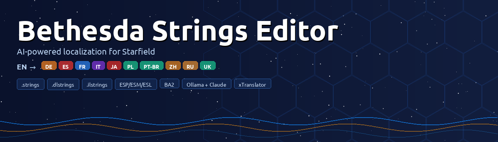

# Bethesda Strings Editor

AI-assisted localization tool for Bethesda game files (Starfield). Translates `.strings`, `.dlstrings`, `.ilstrings`, BA2 archives, ESP/ESM plugin files, and Starfield interface TXT files between all 12 supported languages using a locally-running Ollama model or the Claude API, with a full quality-checking and review workflow.



[](https://python.org)
[](https://doc.qt.io/qtforpython)
[](https://ollama.com)
[](https://claude.ai)
[](LICENSE)
[](https://www.nexusmods.com/starfield/mods/17158)
[](https://deepwiki.com/0xra0/bethesda-strings-editor)

---

## Ollama models

| Model | Purpose | Hub |
|-------|---------|-----|
| `translategemma3-st` | Game string translation — Gemma 3 12B fine-tune (6.5 GB) | local GGUF |
| `translategemma3-st-2` | Same fine-tune, reduced context (8 k) for GPU inference | local GGUF |
| `mamaylm` | MamayLM Gemma 3 12B IT v2.0 — INSAIT Ukrainian fine-tune | local GGUF |
| `gemma4-opus48-st` | Gemma 4 12B IT fine-tuned on Claude Opus reasoning data | local GGUF |
| `qcgemma4-st` | Translation quality checking — Gemma 4 E4B fine-tune (16 issue codes) | [0xra/bethesda-qc](https://ollama.com/0xra/bethesda-qc) |

Pull the QC model from the hub:

```bash
ollama pull 0xra/bethesda-qc
ollama cp 0xra/bethesda-qc qcgemma4-st
```

For translation models, edit `Modelfile` / `Modelfile.qc` / `Modelfile.gemma4-opus48` to set the correct `FROM` path to your local GGUF, then:

```bash
ollama create translategemma3-st -f Modelfile
ollama create qcgemma4-st -f Modelfile.qc
ollama create gemma4-opus48-st -f Modelfile.gemma4-opus48
```

---

## Supported languages

All 9 official Starfield languages plus Russian, Ukrainian, and Korean:

| Code | Language |
|------|----------|
| `en` | English |
| `de` | German |
| `es` | Spanish |
| `fr` | French |
| `it` | Italian |
| `ja` | Japanese |
| `ko` | Korean |
| `pl` | Polish |
| `ptbr` | Portuguese (Brazil) |
| `zhhans` | Chinese (Simplified) |
| `ru` | Russian |
| `uk` | Ukrainian |

Each language pair has a dedicated system prompt with register rules, script conventions, and native examples.

---

## Features

### Translation
- **Parallel AI translation** via [Ollama](https://ollama.com) with configurable concurrency (default 10 workers)
- **Claude API backend** — drop-in alternative to Ollama; select Haiku 4.5, Sonnet 4.6, or Opus 4.8 in Settings
- **AI-fix mode** — instead of retranslating from source, sends the existing flawed translation + QC issue descriptions to the model for targeted correction; faster and more precise than a full retranslation
- **Language-pair prompts** — dedicated system prompts for every source→target combination with register rules, script conventions, and native examples
- **Translation memory** — known strings are looked up before calling the model, so they are never retranslated
- **Translation cache** — SHA-256-keyed JSON cache (up to 50,000 entries) persisted across sessions
- **Term protector** — 8,000+ Starfield-specific terms are replaced with placeholder tokens before the AI sees the text and restored afterward, preventing mistranslation of proper nouns
- **Pipeline post-processing** — per-string passes after every translation: game tag restoration, case matching, line-prefix preservation, newline structure repair, mixed-script repair, guillemet close-quote enforcement
- **Glossary system** — CSV/TBX/JSON glossary with in-app editor, term suggestions dock, and automatic injection into AI prompts
- **Character Persona Profiling** — assign a voice profile to any string or quest (Freestar Ranger, SysDef Officer, Crimson Fleet Pirate, House Va'ruun Zealot, UC Civilian, Robot/Automaton, Narrator, or custom); each profile overrides the AI system prompt and temperature
- **Lore RAG** — local SQLite FTS5 lore database (built-in UESP downloader); relevant faction, location, and character articles are retrieved per string and injected into the AI prompt
- **Pre-translation estimator** — scores each string 0–100 to predict translation difficulty before the AI runs
- **Skip string types** — exclude Book, Note, or other categories from AI batch translation
- **Protect named entities** — opt-in setting to extend term protection to faction/ship/character names inferred from the loaded file
- **Claude pre-flight cost estimator** — shows token count and estimated cost before starting a batch translation

### File support
- **Binary string files**: `.strings` (null-terminated), `.dlstrings` / `.ilstrings` (length-prefixed)
- **BA2 archives**: read and write Starfield v2 BA2 files (GNRL type, zlib-compressed); picker dialog for multi-entry archives
- **ESP/ESM plugins**: non-localized plugins where text is stored directly in field buffers
- **Starfield interface TXT**: `translate_en.txt` / `translate_ru.txt` key=value interface string files
- **xTranslator SST XML**: import/export in xTranslator format (match by `sID`, fallback to source text)
- **Drag-and-drop** file loading with format validation
- **NexusMods Translation Browser** — search NexusMods for existing translation mods, browse their files, and import `.strings`/`.dlstrings`/`.ilstrings` directly as a Translation Memory or merge into the current file; zip, 7z, and rar archives are automatically extracted; free-account downloads via browser cookies (`curl-cffi`)
- **NexusMods upload** — v3 multipart upload client with presigned S3 URLs (File → Upload to NexusMods)

### Quality assurance
- **Quality checker** — 20+ checks: missing/extra game tags, empty or untranslated strings, source-language leakage, English leak, suspicious length ratios, newline mismatches, truncated AI output, AI artifact prefixes, encoding failures, unclosed guillemets, unmatched brackets, script coverage (CJK), and more
- **RU→UK false-positive reduction** — UNTRANSLATED check uses Russian-exclusive character detection (ы/э/ё/ъ) and minimum word-count threshold to avoid flagging legitimately identical short words; length-ratio skip applies only to short Cyrillic sources (abbreviation expansions)
- **Hunspell spell-check** — per-language `SPELL_ERROR` warnings using system dictionaries
- **AI quality model** (`qcgemma4-st`) — fine-tuned Gemma 4 E4B that detects 16 issue codes with chain-of-thought reasoning and structured `VERDICT: GOOD / ISSUES_FOUND` output with `AUTOFIX`/`RETRANSLATE` recommendations
- **Font & Glyph Checker** — parses Scaleform SWF font atlases and TTF/OTF cmap tables; flags translation characters that will render as squares in-game and suggests auto-fixable substitutes
- **Auto-Fix All** — one-click batch application of all mechanically correctable issues (whitespace, capitalization, character substitution, missing newlines, truncated translations, unclosed guillemets)
- **Per-code hide filter** — suppress specific QC issue codes from the results table for the current session
- **Retranslation queue** — strings flagged by QC are queued and retranslated with a per-string hint describing what went wrong
- **Error-code filter** — filter QC results by code (MISSING_TAGS, NEWLINE_COUNT_MISMATCH, etc.)
- **Consistency checker** — finds the same source string translated differently across the file, with canonical-form picker and batch replace
- **Plugin validator** — scans ESP/ESM for NPC dialogue camera bugs: missing Localized flag, stray DIAL/SCEN/INFO records, ONAM overrides, missing master dependencies

### Review tools
- **Visual Context Preview** (Ctrl+Shift+P) — dockable panel that renders the current string inside a faithful recreation of the Bethesda UI using actual game fonts extracted from `fonts_uk.swf` / `fonts_en.swf`; pixel-exact borders, noise tile, and dark gradient from `dialoguemenu.swf`; auto-detects context type (Dialogue, Quest, Book, Note, Terminal, UI); colour-coded overflow indicator; Source/Translation/Both view modes
- **Dialogue Tree Visualizer** — interactive quest → topic → response node graph (Translation → Dialogue Tree) with Starfield dark-space visual theme; click any node to jump to that string in the table
- **Audio / TTS Preview** (Ctrl+Shift+A) — dockable panel with eSpeak-NG and Piper backends; synthesizes a TTS read-out of the translation so timing can be compared against the original game audio; colour-coded timing bar (green ≤ 110 %, orange ≤ 130 %, red > 130 %)
- **Version comparison** — diff two game versions, migrate unchanged translations, export CSV/HTML reports; batch folder comparison
- **Diff viewer** — side-by-side word-level or character-level diff; editable right pane with live diff update; HTML export
- **Advanced search** — regex and fuzzy search across source and translation columns; batch Find & Replace

### UI / workflow
- **Zen / Focus Mode** (F11) — full-screen distraction-free editor with large source and translation panels, pending-string counter, per-string status badge
- **Multi-monitor / detached panes** — Translation Editor dock (Ctrl+Shift+E) floats to any monitor; Pop Out String List (Ctrl+Shift+L) opens a second table window sharing the same selection model
- **Claude AI Assistant dock** (Ctrl+Shift+C) — chat about the current string and apply Claude's suggested translation with one click
- **Command palette** (Ctrl+K) and vim-style navigation (j/k, G)
- **Keyboard shortcuts editor** — rebind any action
- **F7** → jump to next untranslated; **Ctrl+Enter** → approve; **Ctrl+R** → reject
- **Encoding detection** — auto-detects UTF-8, CP1251, CP1252, CP1250, GBK/GB2312, BOM variants; override per-file
- **Themes** — 16 built-in themes: Slate, Midnight, Nord, Dracula, Catppuccin, Light, Solarized Dark, Solarized Light, Gruvbox, Tokyo Night, Monokai, One Dark, Sepia, Starfield, Starfield Terminal, High Contrast; plus custom QSS file support
- **GPU monitor** — status bar widget showing GPU utilisation, VRAM usage, and temperature (AMD sysfs + NVIDIA nvidia-smi; auto-hides if no GPU found)
- **UI translations** — interface available in Ukrainian ✓, German, Spanish, French, Polish, Czech, Korean (community WIP)
- **Desktop notifications** on batch completion
- **Crash recovery** — periodic auto-save; recovery dialog offered at startup if the previous session ended unexpectedly
- **Security audit log** — append-only JSON-lines file recording file operations and translation batches; API keys stored in system keyring with AES-256-GCM file fallback

---

## Requirements

- Python 3.10+
- [Ollama](https://ollama.com) running locally (or a Claude API key for the Claude backend)
- Audio playback requires `paplay` (PulseAudio), `ffplay`, or `aplay` — any of the three will be auto-detected

```bash
pip install -r requirements.txt
```

Core dependencies: `PySide6>=6.6`, `requests>=2.31`, `cryptography>=43.0`, `anthropic>=0.25`

Optional:
- `keyring>=25.0` — API key storage in system keyring
- `hunspell>=0.5.5` or `spylls>=0.1.7` — spell-check (hunspell CLI used as fallback)
- `curl-cffi>=0.7` — free-user NexusMods downloads via browser cookies

---

## Running

```bash
python main.py
```

Logs are written to both stdout and `translator.log` in the project root.

---

## Project structure

```
bethesda_strings/              Pure Python parsing library (no Qt dependency)
  core.py                      Binary parser/writer for .strings/.dlstrings/.ilstrings
  ba2_handler.py               BA2 archive reader/writer (Starfield v2, FO4 v1)
  esp_handler.py               ESP/ESM plugin parser (non-localized plugins)
  txt_handler.py               Starfield interface TXT parser (translate_en/ru.txt)
  xml_handler.py               xTranslator SST XML import/export
  encoding.py                  Encoding detection and conversion
  version_diff.py              Game-version diff and translation migration
  character_profiles.py        Character persona profile definitions
  font_checker.py              SWF/TTF glyph coverage checker (library layer)
  lore_db.py                   SQLite FTS5 lore database and UESP downloader
  dialogue_tree.py             Quest → Topic → Response tree parser

gui/                           PySide6 application layer
  main_window.py               Top-level window, file I/O, translation orchestration
  ollama_worker.py             QThread worker — parallel calls, per-language prompts, AI-fix mode
  claude_translation_worker.py Claude API drop-in replacement for OllamaWorker
  claude_chat_panel.py         Dockable AI assistant chat panel
  gpu_monitor.py               Status bar GPU utilisation widget (AMD sysfs + NVIDIA nvidia-smi)
  visual_context_preview.py    Game-accurate string rendering using extracted SWF fonts/assets
  dialogue_tree_dialog.py      Interactive quest → topic → response node graph
  audio_preview_panel.py       TTS preview dock (eSpeak-NG / Piper backends)
  tts_engine.py                TTS synthesis engine
  focus_overlay.py             Zen / full-screen focus mode
  lore_rag_manager.py          SQLite FTS5 lore database + UESP downloader
  lore_rag_dialog.py           Lore database management dialog
  quality_checker.py           Post-translation QA checks (20+ codes) and auto-fix
  quality_dialog.py            QA results dialog — filtering, per-code hide, auto-fix, retranslation
  ai_qc_worker.py              Worker thread for qcgemma4-st quality model
  spell_checker.py             Hunspell spell-check wrapper (3 backends: lib / spylls / CLI)
  font_checker_dialog.py       SWF/TTF glyph coverage checker dialog
  string_table.py              QAbstractTableModel for strings, ESP, and TXT modes
  term_protector.py            Placeholder-based term protection (8000+ terms)
  translation_cache.py         SHA-256-keyed persistent translation cache
  translation_memory.py        Pre-loaded map of string ID → known-good translation
  glossary.py                  Glossary data model, CSV/TBX/JSON I/O
  consistency_checker.py       Finds inconsistent translations of identical source strings
  version_compare_dialog.py    Game-version diff UI, migration, CSV/HTML export
  diff_viewer.py               Side-by-side word/character-level diff viewer
  pre_translation_estimator.py Difficulty scorer (0–100) with weight learning
  profile_editor_dialog.py     Character persona profile editor
  profile_assign_dialog.py     Assign persona profiles to strings / quests
  keyboard_manager.py          Rebindable shortcuts, vim navigation, command palette
  theme_manager.py             16 built-in QSS themes + custom theme loader
  nexusmods_uploader.py        NexusMods v3 multipart upload client
  nexusmods_browser_dialog.py  NexusMods translation browser (card grid, async thumbnails)
  nexusmods_client.py          NexusMods REST v1 + GraphQL v2 API client
  app_settings.py              AppSettings dataclass, JSON + QSettings persistence
  secret_store.py              API key storage (keyring + AES-256-GCM fallback)
  audit_log.py                 Append-only security audit log (JSON-lines)
  crash_recovery.py            Periodic auto-save and recovery dialog

data/
  fonts/                       Game fonts extracted from Starfield SWF assets
    RF_35_M.ttf                Cyrillic body font (UK locale, $MAIN_Font)
    RF_55_M.ttf                Cyrillic bold
    RF_55_SB.ttf               Cyrillic semi-bold
    NB_Architekt_Light.ttf     Latin body font (EN locale)
    NB_Architekt.ttf           Latin bold
  dialogue_bg_tile.png         50×50 noise tile from dialoguemenu.swf
  *_words.txt                  Word lists for source-language leak detection (12 languages)

scripts/
  apply_quality_fixes.py       CLI: apply auto-fixes from a JSON report to SST XML
  extract_sharegpt_dataset.py  Export EN→target string pairs as ShareGPT JSONL
  create_qc_dataset.py         Generate QC training dataset (14,928 examples, 16 issue codes)
  compile_translations.sh      Recompile .ts → .qm UI translation files
  download_lang_dicts.py       Download Hunspell dictionaries for all supported languages
  extract_starfield_glossary.py Build starfield_glossary.json from string files

packaging/
  bethesda-strings-editor.desktop      Linux desktop entry (file associations)
  bethesda-strings-editor-mime.xml     MIME-type definitions for .strings/.esp/.ba2
```

---

## UI translation

UI translations live in `gui/translations/<locale>.ts`. After editing any `.ts` file:

```bash
./scripts/compile_translations.sh
```

Supported locales: `uk_UA`, `de_DE`, `fr_FR`, `es_ES`, `pl_PL`, `cs_CZ`, `ko_KR`.

---

## Tests

```bash
python -m pytest tests/
```

---

## License

MIT — see [LICENSE](LICENSE).
